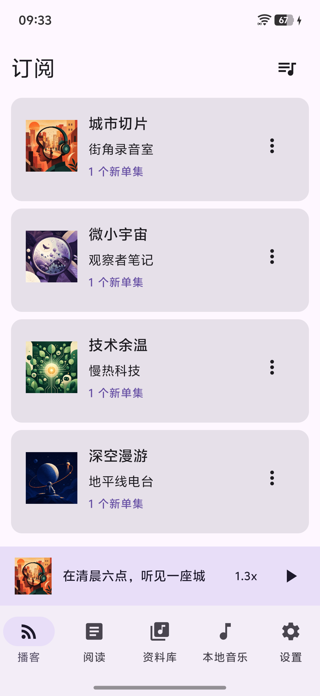
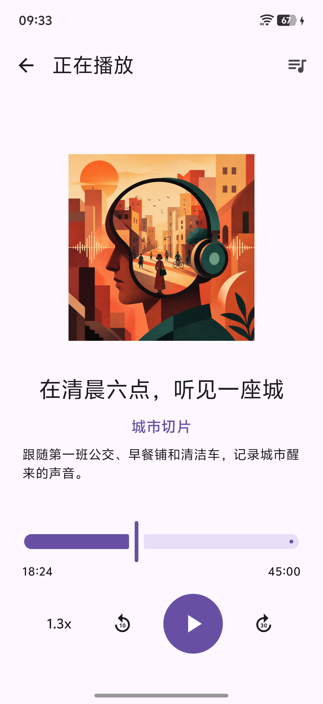

**English** | [简体中文](README.zh-CN.md)

# XPOD

XPOD is a local-first podcast and article reader for Android 13+. It brings podcast RSS, article RSS/Atom, offline playback, a native article reader, and a user-selected local music library into one Jetpack Compose app.

Current version: **0.9.4** · Android **13+** · **arm64-v8a** · [Apache-2.0](LICENSE)

## Screenshots

<p align="center">
  
  
  
</p>

More captured screens and the reproducible showcase-data workflow are available in [`screenshots/`](screenshots/README.md).

## Features

### Podcasts and playback

- Add podcast feeds over HTTPS and keep stable podcast and episode identifiers across refreshes.
- Browse subscriptions, new episodes, unplayed episodes, favorites, recent playback, and continue-listening items.
- Play audio through a Media3 foreground service with persistent playback state.
- Use speed controls, 10-second rewind, 30-second forward, previous/next actions, and a full player.
- Build a queue with play-next and add-to-queue actions, then reorder, remove, or clear items.
- Download episodes into app-specific storage. Downloads use unmetered networks by default, with an option to allow cellular networks.

### Articles

- Add RSS or Atom article feeds through the same subscription flow used for podcasts.
- Filter by feed, unread state, or favorites and update read state individually or in bulk.
- Read structured content in a native Compose reader, including headings, images, quotes, lists, code, and tables.
- Open the original page inside the app when the feed does not provide enough content.

### Local music

- Select a folder with Android's Storage Access Framework; XPOD does not request broad storage access.
- Recursively index supported audio documents while keeping the original files in place.
- Search by title, artist, or album and use play-all, queue, shuffle, and repeat controls.
- Recognized extensions include AAC, AMR, FLAC, M4A, MP3, OGA, OGG, Opus, WAV, and WMA, subject to device codec support.

### Subscriptions and organization

- Import and export mixed podcast and article subscriptions as OPML.
- Refresh podcast and article feeds once per day when a network connection is available.
- Reorder or hide optional tabs. The same order is used by the phone bottom bar and tablet navigation rail.
- Choose system, light, or dark theme and optionally use Android dynamic colors.
- Use adaptive phone and tablet layouts; screens at 600dp or wider use the large-screen navigation and content arrangement.

### Optional Cloud Memos integration

- Connect an HTTPS [Cloud Memos](https://github.com/lurenyang418/cloud-memos) instance with a `cm_pat_` read-write token.
- Browse, search, filter, create, archive, restore, share, and move supported Memos to the recycle bin.
- Save podcast episodes or articles as Markdown Memos.
- Store the API token encrypted with Android Keystore; disconnecting removes the stored credential and key.

## Local-first and privacy

XPOD does not require an XPOD account. Podcast, episode, article, playback, queue, preference, and local-music index data are stored on the device with Room or DataStore. App backup is disabled.

Network access is used only for actions that inherently need it: retrieving feeds and artwork, streaming or downloading media, opening original pages, and communicating with a Cloud Memos instance configured by the user. Downloads stay in app-specific storage, and local music access is limited to folders explicitly selected through the system picker.

Cloud Memos is optional and is not a general cross-device sync service for XPOD's local database.

## Requirements

- JDK 17
- Android SDK Platform 36.1
- An Android 13+ arm64 device or emulator for installation

The repository includes the Gradle 9.6.1 wrapper, so a separate Gradle installation is not required.

## Build and install

```bash
git clone https://github.com/lurenyang418/xpod.git
cd xpod
./gradlew assembleDebug
```

The Debug APK is generated at:

```text
app/build/outputs/apk/debug/app-arm64-v8a-debug.apk
```

Install it on a connected device with:

```bash
./gradlew installDebug
```

The Debug application ID is `tech.lury.xpod.debug`, so it can coexist with the release application ID `tech.lury.xpod`.

To build the optimized release variant:

```bash
./gradlew assembleRelease
```

The output is `app/build/outputs/apk/release/app-arm64-v8a-release.apk`. Configure `keystore.properties` before distributing a production build; without it, the local release variant falls back to the debug signing key. Tagged builds are created by [the release workflow](.github/workflows/build-apk.yml) and published to [GitHub Releases](https://github.com/lurenyang418/xpod/releases).

## Verification

Run the recommended checks before submitting a change:

```bash
./gradlew spotlessCheck testDebugUnitTest assembleDebug lintDebug
```

With a connected device or emulator:

```bash
./gradlew connectedDebugAndroidTest
```

## Architecture

| Layer | Responsibility | Main technology |
| --- | --- | --- |
| UI | Adaptive Compose screens; actions flow through `MainViewModel`; state is exposed with `StateFlow` | Jetpack Compose, Material 3, Lifecycle |
| Data | Feed parsing, stable entities, persistence, settings, OPML, local music, and Cloud Memos | Room, DataStore, OkHttp, Android Keystore, SAF |
| Playback | Background audio, playback restoration, queues, shuffle/repeat, and media-library integration | Media3 `MediaLibraryService` |
| Downloads | App-private episode downloads with configurable network requirements | Media3 `DownloadService` and `DownloadManager` |
| Background work | Daily podcast and article refresh with network constraints and retry behavior | WorkManager |
| Dependency injection | Application-wide repositories, database, network client, and clock | Hilt |

The normal data path is: Compose UI → `MainViewModel` → repositories/controllers → Room, DataStore, Media3, SAF, or explicit external I/O.

## Project boundaries

- Android 13 / API 33 is the minimum supported version.
- Current APK outputs target `arm64-v8a` only.
- Feed URLs and podcast audio URLs must use HTTPS.
- XPOD is local-first; it does not currently synchronize the Room database between devices.

## Contributing

Read [`AGENTS.md`](AGENTS.md) for the project commands and engineering rules. Keep persistence and external I/O in repositories, expose UI state from ViewModels with `StateFlow`, preserve stable feed identifiers, and run the focused test suite for every changed behavior.

## License

XPOD is available under the [Apache License 2.0](LICENSE).
